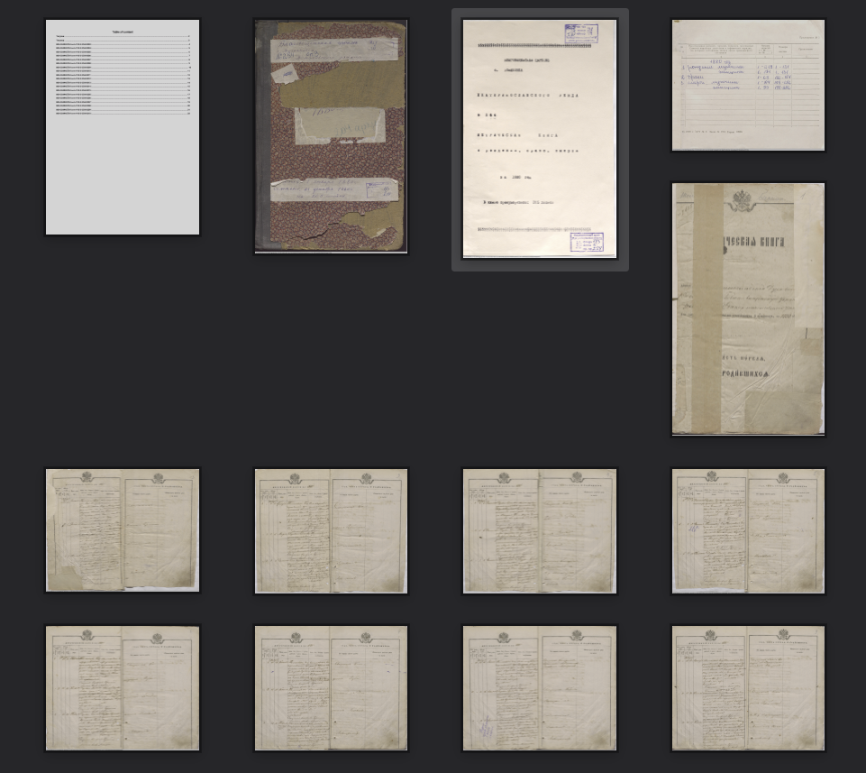
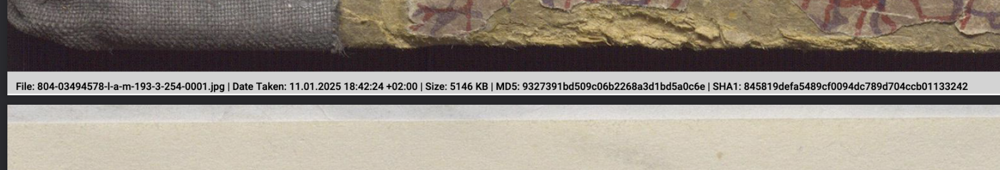

# DocumentBuilder

> 🌐 This README is available in other languages:
> [Українська](./README.uk.md)

**DocumentBuilder** is a lightweight console application designed to create documents. Currently, it supports generating PDF documents from a folder of images. This tool is ideal for automated scenarios, providing flexibility and metadata integration for easy navigation and organization.

## Features

- **PDF Generation**: Combine a folder of images into a single PDF document.
- **Metadata Integration**: Supports a YAML metadata file to describe the final document and its pages.
- **Image Details Overlay**: Automatically adds an overlay on each PDF page with details about the original input files (e.g., file name, size, hashes).
- **Automation-Ready**: Packaged as a single binary for seamless use in automated workflows.

## Usage

Run the application with the following syntax:

```plaintext
<program> <inputDirectory> <outputDirectory>
```

### Arguments

- `inputDirectory`: The directory containing image files to include in the PDF.
- `outputDirectory`: The directory where the resulting PDF will be saved.

### Notes

- If `outputDirectory` is not provided, the current directory will be used.
- The `inputDirectory` must exist and contain image files.
- The `outputDirectory` must exist or be created beforehand.

### Examples

#### Windows

```plaintext
document-builder-1.0.0.exe "C:\Users\YourUser\Pictures" "C:\Users\YourUser\Documents"
```

#### macOS

```plaintext
./document-builder-1.0.0 "/Users/youruser/Pictures" "/Users/youruser/Documents"
```

#### Linux

```plaintext
./document-builder-1.0.0 "/home/youruser/Pictures" "/home/youruser/Documents"
```

## Metadata Format

**DocumentBuilder** supports a YAML metadata file that allows describing the general information about the document, as well as adding specific metadata for each page. Here is an example of the format:

```yaml
# General document metadata
outputFileName: "result.pdf"
title: "Document Title"
author: "Author Name"
subject: "Document Subject"
keywords: "Keyword1, Keyword2, Keyword3"
licenseType: "Creative Commons Attribution-ShareAlike 4.0 International (CC BY-SA 4.0)"

# Page-specific metadata, using image file names (with extensions)
pages:
  image1.jpg:
    title: "First Page Title"
    description: "Description of the first page content."
  image2.jpg:
    title: "Second Page Title"
    description: "Description of the second page content."
```

### Explanation

- **`outputFileName`**: The name of the PDF file to be generated. Must end with `.pdf`.
- **`title`**: The title of the document.
- **`author`**: The author of the document.
- **`subject`**: The subject or category of the document.
- **`keywords`**: A comma-separated list of keywords.
- **`licenseType`**: The license type of the document.
- **`pages`**: Specific metadata for pages, referenced by the corresponding image file names (with extensions).

## Output Example

Here’s an example of a PDF generated by the tool:






## Why Use DocumentBuilder?

DocumentBuilder stands out for its simplicity and versatility:

- **Streamlined Workflows**: Automate document creation with minimal setup.
- **Customizable Metadata**: Define YAML metadata to describe the document's structure and content.
- **Detailed Page Overlays**: Include file information for better traceability.
